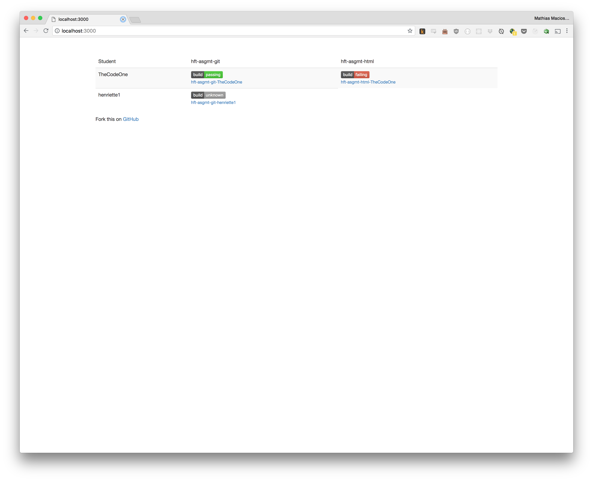

# hft-assignments-check-web

## Running the software
Basically just `npm start` but you need to set two env vars:
`CLASSROOM_ORG_NAME` and `TEACHER_ID`.

| env var                | value type  | Description          |        
| ---------------------- | ----------- | -------------------- | 
| CLASSROOM\_ORG\_NAME   | string      | GitHub org-name      |
| TEACHER\_ID            | string      | GitHub Username      |
| GITHUB\_CLIENT\_SECRET | string      | GitHub Client Secret |
| GITHUB\_CLIENT\_ID     | string      | GitHub Client Id     |

## Description
This repo is for checking the assignments from a Github Classroom-Org against their travis-ci build.

My workflow is as follows:

1. Get student Email addresses
2. Create a classroom
3. Create assigments based on my starter-repos
4. Activate all repos in travis-ci
5. Run this small project to get an overview, co check if a student has passed

This code basically queries the GitHub Graph API to get repos based on an org.

## Important notice
I have not really tried this in the field, yet. Feel free to clone / fork do whatever you want with this. I did not focus on make things nice or but much time into it, so feel free to improve this code. I KNOW IT'S UGLY.